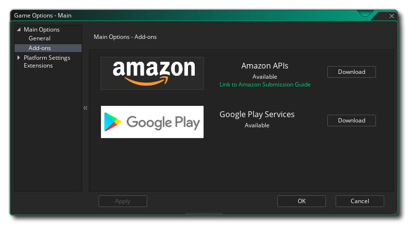
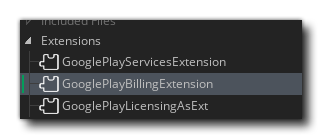

@title Using The Google Play IAP Extension

# Using The Google Play IAP Extension

In this article we'll be looking at how you create and test In-App Purchases (IAP) in your Android apps for the Google Play app store using the Google Play Billing API. This API is available as part of the Google Play Services IAP extension.

> The methods shown in this guide require GameMaker 2.2.4 runtimes or newer, plus at least v3.1.8 of the "Google Play Services" extension from the Marketplace - if you're using 2.2.3 runtimes (or older) you will need to update and ensure you have the correct extension in your project before you can follow this guide.

Before continuing, you should have already set up and tested the Android export and have a test project or finished game that you want to add IAPs into.

You can find out how to set up GameMaker for the Android platform here:

> [Setting Up For Android](https://help.gamemaker.io/hc/en-us/articles/115001368727-Setting-Up-For-Android)

[[Note: If you want to add Amazon Appstore IAPs this is a slightly different process and so there is a separate helpdesk article available here:

> [Amazon: Setting Up IAPs](https://help.gamemaker.io/hc/en-us/articles/360002299278-Android-Using-The-Amazon-IAPs-Extension)

We recommend that before doing anything with this extension, you take a moment to look over the official Google Play Billing API documentation, as it will familiarise you with many of the terms and concepts required to use the extension correctly, and many of the functions in the extension are practically 1:1 mappings of the methods described there:

> [Google Developer Docs: Billing Overview](https://developer.android.com/google/play/billing/billing_overview)

]]

[[Important: This article does not cover subscription in-app purchases. Subscriptions require the use of a server for verification which is outside of the scope of this article. For more information see the following pages from the Google Documentation:

* [Google Developer Docs: Add Subscription-Specific Features](https://developer.android.com/google/play/billing/subscriptions)
* [Google Developer Docs: Verify A Purchase On A Server](https://developer.android.com/google/play/billing/billing_library_overview#Verify-purchase)

]]
 

## Set Up The Products On Google Play

Before you can add any in-app purchase code and test it, you first have to [set up an app listing](https://support.google.com/googleplay/android-developer/answer/9859152) on your [Google Play Developer Console](https://developer.android.com/distribute/console/index.html) for the game and you will also have had to upload an APK to one of the available channels for testing - either Internal Test (recommended), Alpha or Beta is fine. Once that has been done, you can then go to the **Store Presence** section and select **In-App Products** to take you to the IAP setup section:


Here is where we'll be creating the initial in-app purchase details.

For the sake of this tutorial, we'll be creating two simple IAPs, one which is **Consumable** and one which is **Durable** (non-consumable). Consumable purchases are things that can be bought repeatedly, while non-consumables are things that can only be bought once. An example of a consumable would be when the player loses the game and is offered the chance to buy a continue, and if they then die a second time they can buy another continue, and so on. An example of a durable would be a game that shows ads but permits the player to pay to have them removed - the player pays once only and the ads are gone forever.

[[Note: In the Google Play console, all products that can be bought in GameMaker are classed as **Managed Products** or **Subscriptions** and there is no distinction between consumable and durable at this level. That distinction will be handled later, in the code for the game.]]

To start with, we click the button labelled **Create Managed Product**. In the window that opens you will need to fill out the following details:

* The unique IAP Product ID: This is the product ID string, which must start with a lowercase letter or a number and must be composed of only lowercase letters (a-z), numbers (0-9), underscores (_), and periods (.). Be sure to plan your product ID namespace carefully as you cannot modify an item's product ID after the item is created and you cannot reuse a product ID within an app.

* Title and Description: Give the IAP a title and a description to identify it easily.

* Status: The status should be set to **Active**, otherwise it won't be available for purchase.

* Pricing: Set the base price for the purchase.

With that done, you can click **Save**.

You can now go ahead and create as many further products as you require (for this article we'll make one more for a **durable** product) and when you're done, go back to the in-app purchase dashboard, where we can see the products all listed together:


## Setting Up Your Game

Now that we have our initial IAPs set up in the Google Play Console, we need to prepare our game. For that you'll need to get the Google Licence Key from the Console and add it into GameMaker. You can get the key by going to the section `Development Tools` > `Services and APIs`:


Carefully copy this whole string and then in GameMaker open the [Android Game Options](https://manual.gamemaker.io/monthly/en/Settings/Game_Options/Android.htm) and browse to the section **Packaging**. Here you need to paste the licence key string into the section labelled *Google Licencing Public Key*:


We now need to install the extensions that the IAP system requires to communicate with the Google APIs. The first one we need is the [Google Play Services](https://github.com/YoYoGames/GMEXT-GooglePlayServices) extension. You can get this easily by going to the `Game Options` > `Add-ons` page and clicking the *Download* button next to the extension.



This will add the extension to your project, and you can close the Game Options once this is complete.

[[Note: The Google Play Services extension comes in various parts, with Ads, Services, Licencing and Billing all included. If you do not require one or more of these options, then that section can be removed from the extension.]]

Once you have downloaded and imported that extension into your project, your Asset Tree should look something like this:



You are now ready to start programming IAP support into your game. 

## Coding IAPs Overview

We need to now get down to coding our IAPs in GameMaker. But before we get to the details, let's take a moment to explain exactly how the IAP system works.

[[Note: This article does not detail all the different responses to each of the functions mentioned, and instead gives an overview of the general workflow required for IAPs to work on Android. For full descriptions of all responses and callbacks for each of the functions, please see the PDF document **"Google Play Billing Manual"** that is included with the extension.]]

The way that GameMaker deals with IAPs is **event-driven**, and most of it will be handled by the ${event.iap}. The general workflow is as follows:

At the start of the game, attempt to connect to the Play Store.
If connection fails, disable the possibility for purchases in your game UI (and set an alarm or something to test again at intervals).
If connection succeeds, add the different products to the internal products list.
After adding the products but before permitting purchases, query existing products and purchases and if there are any consumable purchases or unacknowledged durable/subscription purchases outstanding, then consume or acknowledge them.
Permit the game to run as normal and let the user purchase/consume products as required, checking for connection to the store at all times to prevent erroneous purchases.
 

## Connecting To The Store And Adding Products

The following code is an example of how you would typically initiate in-app purchases, and this would normally only be done *once* at the start of a game, either in a dedicated startup script or object, or in the ${event.game_start} of the first object in your game. How you do it will depend on the project you are adding IAPs to.

The first thing required from you is to try to send a connection request to the Google Play store. This would be done using something like the following code:

```gml
// Prepare some variables for use in the IAP checks
global.IAP_Enabled = false;
global.IAP_PurchaseID[0] = "test_consumable";
global.IAP_PurchaseID[1] = "test_nonconsumable";
global.CurrentTokens = ds_list_create();
global.CurrentProducts = ds_list_create();
// Attempt to connect to the store
var _init = GPBilling_ConnectToStore();
if (_init == gpb_error_unknown)
{
    show_debug_message("ERROR - Billing API Has Not Connected!");
    alarm[0] = game_get_speed(gamespeed_fps) * 10;
}
```
Notice how we have also initialised some global variables to store the product IDs that we want to include for purchase, as well as a few other details (these don't need to be global if all your purchase code is in a single controller object). We also check for any connection issues, and set an alarm to try again sometime in the future (the ${event.alarm} would simply contain the same code).

If the function sends a connect request correctly, then it will trigger an ${event.iap} where you can check to see if the API has successfully connected to the Google Play store or not and then add the products that you want the user to be able to purchase to the internal products list. In the ${event.iap}, the DS map ${var.async_load} will contain an `"id"` key which will contain the constants `gpb_store_connect` for a successful connection) or `gpb_store_connect_failed` (for an unsuccessful connection) which can be parsed something like this:

```gml
var _eventId = async_load[? "id"];
switch (_eventId)
    {
    case gpb_store_connect:
        // Store has connected so here you would generally add the products
        global.IAP_Enabled = false;
        GPBilling_AddProduct(global.IAP_PurchaseID[0]);
        GPBilling_AddProduct(global.IAP_PurchaseID[1]);
        // Etc... for all products
        GPBilling_QueryProducts();
        // Here you would also add any subscription products
        // using the function GooglePlayBilling_AddSubscription().
        // However, you would NOT call the function GPBilling_QuerySubscriptions()
        // here if you have already queried products, but instead query
        // the subscription in the appropriate Async Event (see the "Querying
        // Products" section, below)
        break;
    case gpb_store_connect_failed:
        // Store has failed to connect, so try again periodically
        alarm[0] = game_get_speed(gamespeed_fps) * 10;
        break;
    }
```
In the above example, we check to see if the store has successfully connected or not. If it *hasn't* connected, then we call an alarm to perform the check again at a later moment in time. However if it *has* connected, we can then add our products to the internal product list and query their status.

## Querying Products

Just adding a product to the internal product list does *not* automatically make it available for purchase, and you'll note that in the example code given above for adding the product, we don't set the "IAP_Enabled" variable to true. This is because you must first **query** the product data - as shown in the code - using the ${function.GPBilling_QueryProducts} function (or ${function.GPBilling_QuerySubscriptions} for subscriptions). This will retrieve all the details for each product available, and also make that data available to you via the different `GPBilling_Sku_*()` functions.

The query functions will generate another ${event.iap}, and this time the ${var.async_load} `"id"` key will be the constant `gpb_product_data_response` (for subscription products it will be `gpb_subscription_data_response`) which can be parsed as follows (as part of the switch that checks the `"id"` `async_load` map key):

```gml
case gpb_product_data_response:
    // Retrieve the JSON object response string
    var _json = async_load[? "response_json"];
    var _map = json_decode(_json);
    // Check if the query was successful
    if _map[? "success"] == true
        {
        // Get the DS list of products and loop through them
        var _plist = _map[? "skuDetails"];
        for (var i = 0; i < ds_list_size(_plist); ++i;)
            {
            // The skuDetails key contains a DS list where
            // each list entry corresponds to a single
            // product in DS map form. This DS map can be parsed
            // to extract details like title, description and
            // price, as shown in the example, below:
            var _pmap = _plist[| i];
            var _num = 0;
            while(_pmap[? "productId"] != global.IAP_PurchaseID[_num])
                {
                ++_num;
                }
            global.IAP_ProductData[_num, 0] = _pmap[? "productId"];
            global.IAP_ProductData[_num, 1] = _pmap[? "price"];
            global.IAP_ProductData[_num, 2] = _pmap[? "title"];
            global.IAP_ProductData[_num, 3] = _pmap[? "decription"];
            }
        // Call the query function for subscriptions here, if required:
        // GPBilling_QuerySubscriptions();
        // If not required then query purchase data (this would be done
        // in the subscription product query if those have been queried).
        // Basically, all queries must be made sequentially with the 
        // purchase queries being done last.
        var _purchase_json = GPBilling_QueryPurchasesAsync(gpb_purchase_skutype_inapp);
        // The section below shows how to deal with the purchase queries
        // and you would add the code shown here.
        global.IAP_Enabled = true;
        }
    ds_map_destroy(_map);
    break;
```

Once a product query response has been received, you can go ahead and query again for products and subscriptions with outstanding purchases so you can consume or acknowledge them (as shown in the code above). We also set our "enabled" global variable to true so that we can use it in other parts of the code (if required) to check that we can indeed use IAPs.

 

## Querying Purchases

Now that we have initialised and gotten the data for each of our available purchases, we can deal with the response to the purchase query that was sent. **This must be done before permitting any purchases within your game.** Calling the ${function.GPBilling_QueryPurchasesAsync} function for products or subscriptions will give an immediate response rather than trigger an async event, so we must add additional code into the block shown above for product/subscription queries:

```gml
case gpb_product_data_response:
    var _json = async_load[? "response_json"];
    var _map = json_decode(_json);
    if _map[? "success"] == true
        {
        var _plist = _map[? "skuDetails"];
        for (var i = 0; i < ds_list_size(_plist); ++i;)
            {
            // Any code required to store query information goes here
            }
        var _purchase_json = GPBilling_QueryPurchasesAsync(gpb_purchase_skutype_inapp);
        var _purchase_map = json_decode(_purchase_json);
        if _purchase_map[? "success"] == true
            {
            var _list = _purchase_map[? "purchases"];
            var _sz = ds_list_size(_list);
            for (var i = 0; i < _sz; ++i;)
                {
                var _map = _list[| i];
                if _map[? "purchaseState"] == 0
                    {
                    // Purchase has been made, so now get the product ID
                    // and unique "token" string to identify the purchase
                    var _pid = _map[? "productId"];
                    var _token = _map[? "purchaseToken"];
                    var _add = false;
                    // Check against existing purchase IDs
                    if _pid == global.IAP_PurchaseID[0]
                        {
                        // It's a consumable purchase that hasn't been used yet
                        // so call the consume function on it:
                        GPBilling_ConsumeProduct(_token);
                        _add = true;
                        }
                    else if _pid == global.IAP_PurchaseID[1]
                        {
                        // It's a non-consumable purchase so check and see
                        // if it's been acknowledged yet:
                        if _map[? "acknowledged"] == 0
                            {
                            // It hasn't been acknowledged, so do that now:
                            GPBilling_AcknowledgePurchase(_token);
                            _add = true;
                            }
                        else
                            {
                            // Purchase has been acknowledged so here you
                            // you would check it and set any variables,
                            // for example "global.NoAds".
                            } 
                        }
                    if _add
                        {
                        // add all purchase IDs and tokens into the relevant
                        // DS lists so they can be confirmed later
                        ds_list_add(global.CurrentTokens, _token);
                        ds_list_add(global.CurrentProducts, _pid);
                        }
                    }
                }
            }
        ds_map_destroy(_purchase_map);
        global.IAP_Enabled = true;
        }
    ds_map_destroy(_map);
    break;
```

Notice that we add the product ID and purchase token to DS lists. This is done so that later we can later match the consumed/acknowledged product against the Async Event it generates. We'll go into this in more detail a little further on in this article in the sections on consuming and acknowledging purchases. 

## Purchasing A Product

Once you have queried the products and consumed or acknowledged any outstanding purchases you can then use the purchase functions in your game. These can be called from any event and would be used something like this:

```gml
if GPBilling_IsStoreConnected() && global.IAP_Enabled
    {
    var _chk = GPBilling_PurchaseProduct(global.IAP_PurchaseID[0]);
    // alternatively, for subscriptions:
    // var _chk = GPBilling_PurchaseSubscription(global.IAP_PurchaseID[0]);
    if _chk != gpb_no_error
        {
        // Purchase unavailable, add failsafe code if required
        }
    }
```

You would then have something like the following code in the ${event.iap} to deal with the purchase callback (note that the following code shows a simple purchase verification scheme, however you should ideally verify the purchase with an `http_*()` call to your server, supplying the returned token string, and then consume the purchase when you receive verification in the ${event.http}). In this event the ${var.async_load} `"id"` key will be `gpb_iap_receipt`:

```gml
case gpb_iap_receipt:
    // Get the JSON object response string
    var _json = async_load[? "response_json"];
    var _map = json_decode(_json);
    // Check the response to see if it succeeded
    if _map[? "success"] == true
        {
        // Check the purchases key for any outstanding product purchases
        if ds_map_exists(_map, "purchases")
            {
            // Loop through the purchases list and parse each
            // entry to get the purchase data DS map
            var _plist = ds_map_find_value(_map, "purchases");
            for (var i = 0; i < ds_list_size(_plist);  ++i;)
                {
                var _pmap = _plist[| i];
                var _ptoken = _pmap[? "purchaseToken"];
                var _sig = GPBilling_Purchase_GetSignature(_ptoken);
                var _pjson = GPBilling_Purchase_GetOriginalJson(_ptoken);
                // Verify the purchase before consuming or acknowledging it
                if GPBilling_Purchase_VerifySignature(_pjson, _sig)
                    {
                    GPBilling_ConsumeProduct(_ptoken);
                    // If it is a durable product then you'd call
                    // GPBilling_AcknowledgePurchase();
                    ds_list_add(global.CurrentTokens, _ptoken);
                    ds_list_add(global.CurrentProducts, _pmap[? "productId"]);
                    }
                }
            }
        }
    ds_map_destroy(_map);
    break;
```

Notice again that we add the product ID and purchase token to DS lists. This is done so that later we can match up a consumed or acknowledged product with the Async Event that it triggers. Also note that we are using the function ${function.GPBilling_Purchase_VerifySignature} to verify that the purchase is legitimate before consuming it. This is generally okay for consumable or durable IAPs, but **not for subscriptions**. Subscription IAPs should always be verified through your own server for security (ideally, so should all other IAPs, but Google will accept the method shown above for all products except subscriptions).

## Consuming A Product

Once a product has been purchased, it should be consumed (or acknowledged if it's a durable product, which we'll cover further on) and the corresponding reward given to the user. To consume a product you'd call the function ${function.GPBilling_ConsumeProduct}, which will generate an ${event.iap}, where the ${var.async_load} `"id"` key will be the constant `gpb_product_consume_response`. To deal with this response you'd have something like the following case in the ${event.iap} switch statement:

```gml
case gpb_product_consume_response:
    // Get the JSON object response string
    var _json = async_load[? "response_json"];
    var _map = json_decode(_json);
    var _num = -1;
    // Get the purchase token for the product that has been purchased
    if ds_map_exists(_map, "purchaseToken") 
        {
        // compare the response purchase token against the list
        // of purchase token requests
        for (var i = 0; i < ds_list_size(global.CurrentTokens); ++i;)
            {
            // the response matches a token in the purchase check list
            if _map[? "purchaseToken"] == global.CurrentTokens[| i]
                {
                // Find out what product the token refers to
                if global.CurrentProducts[| i] == global.IAP_PurchaseID[0]
                    {
                    // Assign a reward according to the product being purchased
                    global.Gold += 500;
                    _num = i;
                    break;
                    }
                // Check any other products here…
                }
            }
        // Remove the purchased product and its purchase token
        // from the appropriate check lists
        if _num > -1
            {
            ds_list_delete(global.CurrentProducts, _num);
            ds_list_delete(global.CurrentTokens, _num);
            }
        }
    else
        {
        // Parse the error response codes here
        // and react appropriately
        }
    ds_map_destroy(_map);
    break;
```

For possible response codes that can be returned other than 0, please see the Google Documentation [here](https://developer.android.com/reference/com/android/billingclient/api/BillingClient.BillingResponseCode).

## Acknowledging A Product

Once a product has been purchased, it should be acknowledged (or consumed if it's a consumable product, which we've covered above) and the corresponding feature enabled or disabled for the user. To consume a product you'd call the function ${function.GPBilling_AcknowledgePurchase}, which will generate an ${event.iap}, where the ${var.async_load} `"id"` key will be the constant `gpb_acknowledge_purchase_response`. To deal with this response you'd have something like the following case in the ${event.iap} switch statement:

```gml
case gpb_acknowledge_purchase_response:
    var _map = json_decode(async_load[? "response_json"]);
    var _num = -1;
    // Check the response code to see if it has been successfully acknowledged
    if _map[? "responseCode"] == 0
        {
        var _sz = ds_list_size(global.CurrentProducts);
        // Loop through the products on the consumed/purchase list
        // to find which one triggered this event
        for (var i = 0; i < _sz; ++i;)
            {
            if global.CurrentProducts[| i] == global.IAP_PurchaseID[0]
                {
                // The product has been found so enable/disable
                // the feature it corresponds to
                global.NoAds = true;
                _num = i;
                break;
                }
            // Add further checks for other products here if required…
            }
        // Remove the purchased product and its purchase token
        // from the appropriate check lists
        if _num > -1
            {
            ds_list_delete(global.CurrentProducts, _num);
            ds_list_delete(global.CurrentTokens, _num);
            }
        }
    else
        {
        // Parse the other response codes here
        // and react appropriately
        }
    ds_map_destroy(_map);
    break;
```

## Google Play Testing

Google Play offer a special **static** IAP name `"android.test.purchased"` which can be used instead of your own IAP names to test purchases and subscriptions. This will work like a regular IAP but requires no setting up on the developer console, nor does it require test accounts and other permissions, making it ideal to set everything up and test it before pushing an app into alpha or beta stages with live testers.

It is worth noting, however, that purchases made through this system can only be made *once* normally, before needing to be cleared and reset. This can be done by connecting your test device using USB, then opening the command line window and writing:

```
cd C:\Users\<USERNAME>\AppData\Local\Android\Sdk\platform- tools"
```

and then pressing Enter to change to where the SDK tools are (note that the path may vary depending on the where you have installed Android Studio and the Android SDK). You can then write

```
adb shell pm clear com.android.vending 
to clear the currently purchased products and enable you to re-test purchasing them again.
```

For more information on this, please see [here](https://developer.android.com/google/play/billing/test).

## Summary

Setting up IAPs is a lot simpler than it may first appear, and basically comes down to the following points:

1. Set up a store presence for the game and upload an APK
2. Set up IAPs for the game on the store app console
3. Add the required extension to GameMaker
4. Code your IAPs, with most of the processing being done in the ${event.iap}
5. Upload the final game APK when ready
6. Test!

Please note that the code shown here is designed as a guide only, and is in no way a "one size fits all" solution.