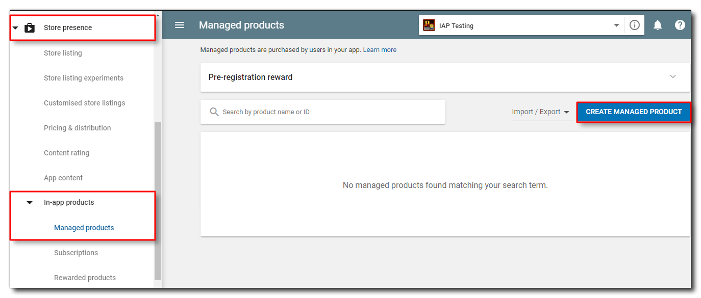
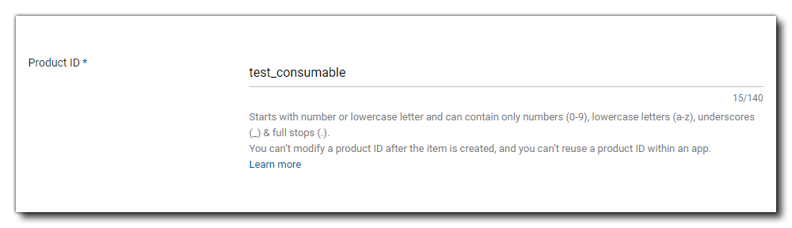
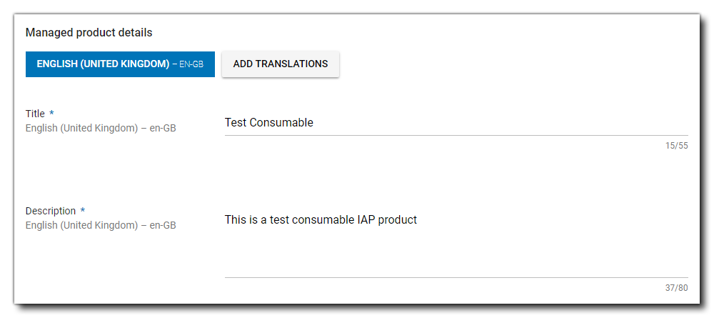
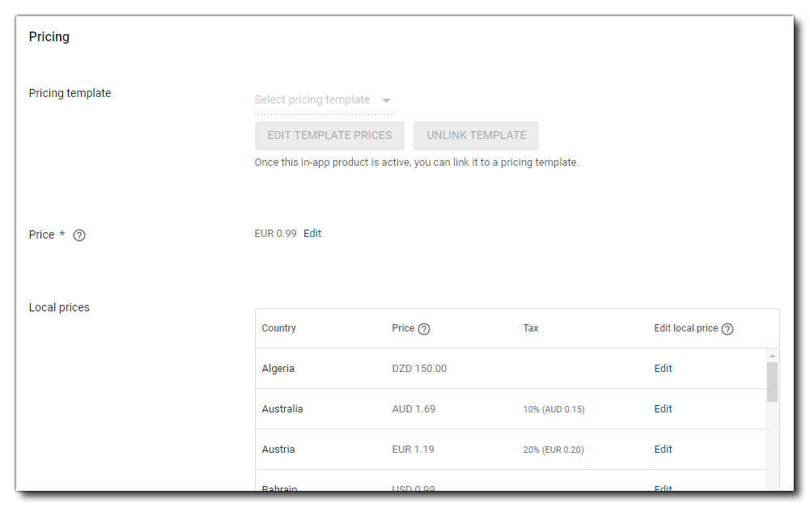
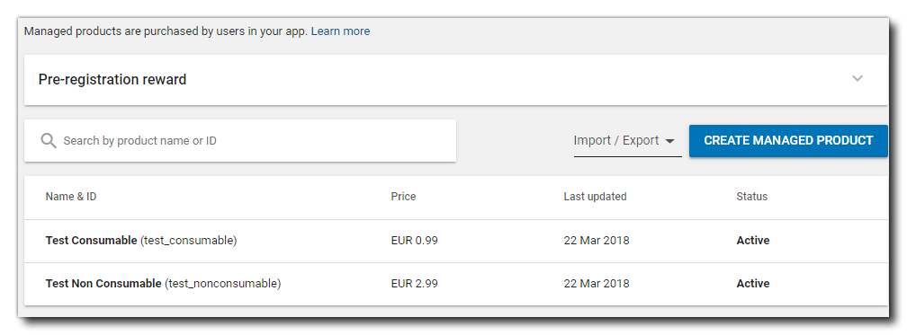
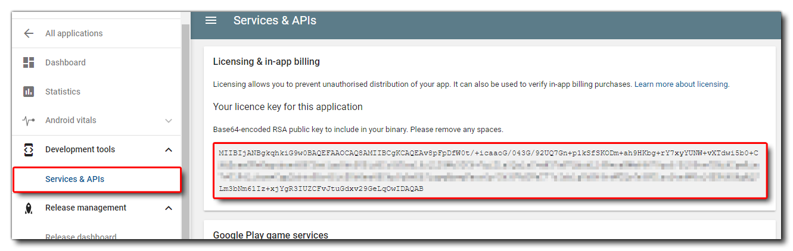
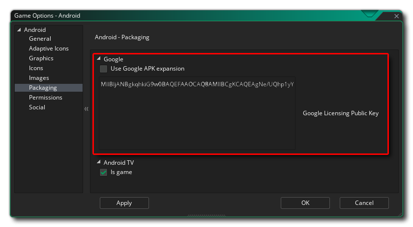

@title Using The Google Play IAP Extension

# Using The Google Play IAP Extension

In this article we'll be looking at how you set up and test In-App Purchases (IAP) in your Android apps for the Google Play app store using the Google Play Billing API.

Before continuing, you should have already set up and tested the Android export and have a test project or finished game that you want to add IAPs into.

You can find out how to set up GameMaker for the Android platform here:

> [Setting Up For Android](https://help.gamemaker.io/hc/en-us/articles/115001368727-Setting-Up-For-Android)

We recommend that before doing anything with this extension, you take a moment to look over the official Google Play Billing API documentation, as it will familiarise you with many of the terms and concepts required to use the extension correctly, and many of the functions in the extension are practically 1:1 mappings of the methods described there:

> [Google Developer Docs: Billing Overview](https://developer.android.com/google/play/billing/billing_overview)

[[Important: This article does not cover subscription in-app purchases. Subscriptions require the use of a server for verification which is outside of the scope of this article. For more information see the following pages from the Google Documentation:

* [Google Developer Docs: Add Subscription-Specific Features](https://developer.android.com/google/play/billing/subscriptions)
* [Google Developer Docs: Verify A Purchase On A Server](https://developer.android.com/google/play/billing/billing_library_overview#Verify-purchase)

]]
 

## Set Up The Products On Google Play

Before you can add any in-app purchase code and test it, you first have to [set up an app listing](https://support.google.com/googleplay/android-developer/answer/9859152) on your [Google Play Developer Console](https://developer.android.com/distribute/console/index.html) for the game and you will also have had to upload an APK to one of the available channels for testing - either Internal Test (recommended), Alpha or Beta is fine. Once that has been done, you can then go to the **Store Presence** section and select **In-App Products** to take you to the IAP setup section:



Here is where we'll be creating the initial in-app purchase details.

For the sake of this tutorial, we'll be creating two simple IAPs, one which is **Consumable** and one which is **Durable** (non-consumable). Consumable purchases are things that can be bought repeatedly, while non-consumables are things that can only be bought once. An example of a consumable would be when the player loses the game and is offered the chance to buy a continue, and if they then die a second time they can buy another continue, and so on. An example of a durable would be a game that shows ads but permits the player to pay to have them removed - the player pays once only and the ads are gone forever.

[[Note: In the Google Play console, all products that can be bought in GameMaker are classed as **Managed Products** or **Subscriptions** and there is no distinction between consumable and durable at this level. That distinction will be handled in the code for the game.]]

To start with, we click the button labelled **Create Managed Product**. In the window that opens you will need to fill out the following details:

* The unique IAP Product ID: This is the product ID string, which must start with a lowercase letter or a number and must be composed of only lowercase letters (a-z), numbers (0-9), underscores (_), and periods (.). Be sure to plan your product ID namespace carefully as you cannot modify an item's product ID after the item is created and you cannot reuse a product ID within an app.

* Title and Description: Give the IAP a title and a description to identify it easily.

* Status: The status should be set to **Active**, otherwise it won't be available for purchase.

* Pricing: Set the base price for the purchase.


With that done, you can click **Save**.

You can now go ahead and create as many further products as you require (for this article we'll make one more for a **durable** product) and when you're done, go back to the in-app purchase dashboard, where we can see the products all listed together:



## Setting Up Your Game

Now that we have our initial IAPs set up in the Google Play Console, we need to prepare our game. For that you'll need to get the Google Licence Key from the Console and add it into GameMaker. You can get the key by going to the section `Development Tools` > `Services and APIs`:



Carefully copy this whole string and then in GameMaker open the [Android Game Options](https://manual.gamemaker.io/monthly/en/Settings/Game_Options/Android.htm) and browse to the section **Packaging**. Here you need to paste the licence key string into the section labelled *Google Licencing Public Key*:



## Google Play Testing

Google Play offer a special **static** IAP name `"android.test.purchased"` which can be used instead of your own IAP names to test purchases and subscriptions. This will work like a regular IAP but requires no setting up on the developer console, nor does it require test accounts and other permissions, making it ideal to set everything up and test it before pushing an app into alpha or beta stages with live testers.

It is worth noting, however, that purchases made through this system can only be made *once* normally, before needing to be cleared and reset. This can be done by connecting your test device using USB, then opening the command line window and writing:

```
cd C:\Users\<USERNAME>\AppData\Local\Android\Sdk\platform- tools"
```

and then pressing Enter to change to where the SDK tools are (note that the path may vary depending on the where you have installed Android Studio and the Android SDK). You can then write:

```
adb shell pm clear com.android.vending 
```

to clear the currently purchased products and enable you to re-test purchasing them again.

For more information on this, please see [here](https://developer.android.com/google/play/billing/test).

## Coding IAPs

With that, everything is ready to start coding IAPs. See the [Quick Start Guide](Quick_Start_Guide) for detailed information.

[[Note: The example project that comes with the extension will always contain the most up-to-date code.]]
